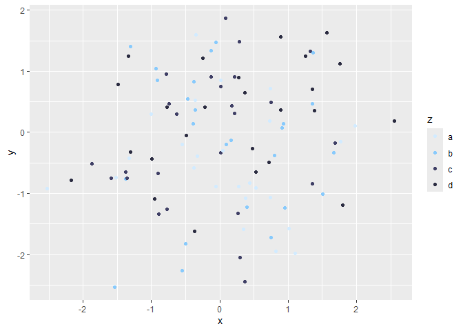
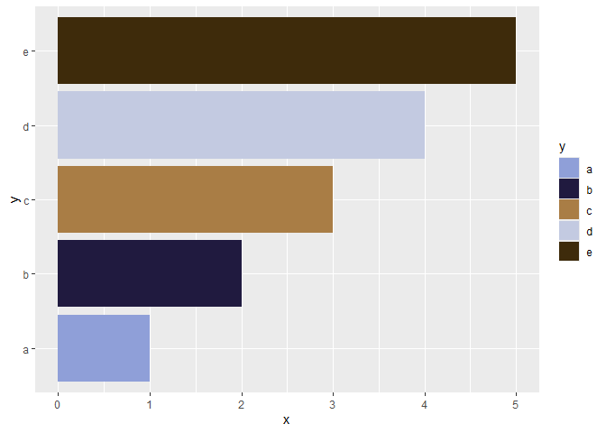
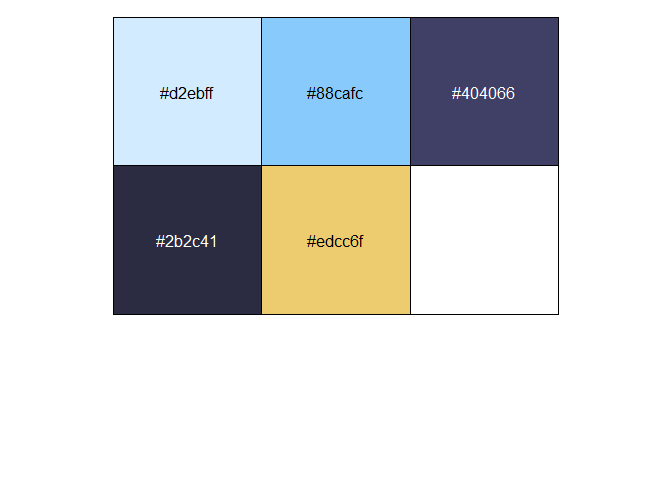
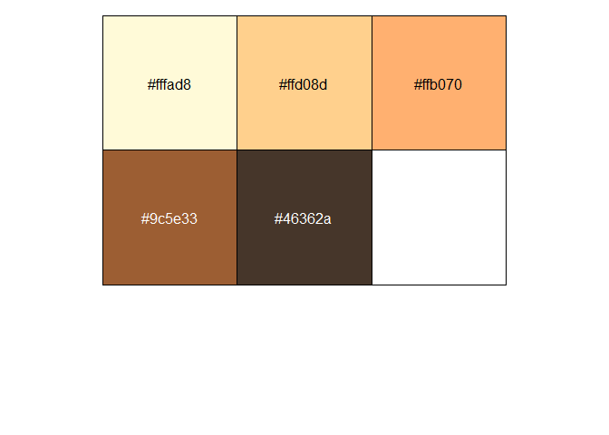
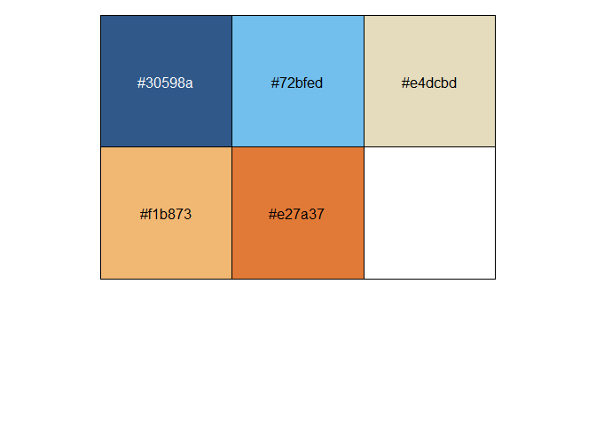
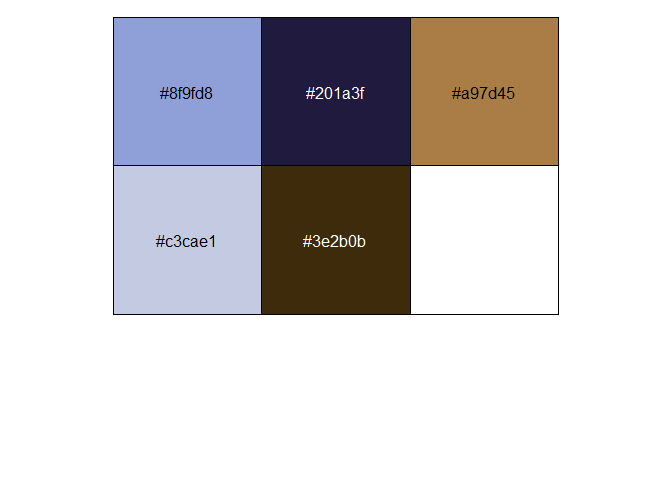

<!-- README.md is generated from README.Rmd. Please edit that file -->

# blueycolors

<!-- badges: start -->

[](https://github.com/ekholme/blueycolors/actions/workflows/R-CMD-check.yaml)

<!-- badges: end -->

blueycolors provides color palettes and ggplot2 `color` and `fill`
scales inspired by [Bluey](https://www.bluey.tv/)

## Installation

You can install blueycolors from Github via:

``` r
devtools::install_github("ekholme/blueycolors")
```

## Usage

There are probably 2 main uses for this package:

1.  Extracting palettes and their associated hex codes
2.  Using these palettes as color or fill aesthetics in ggplot

To extract palettes & hex codes, use the `bluey_palette()` function:

``` r
library(blueycolors)

bluey_palette("bluey")
#> [1] "#d2ebff" "#88cafc" "#404066" "#2b2c41" "#edcc6f"
```

To use the palettes in ggplot, use `scale_color_bluey()` and
`scale_fill_bluey()` for discrete scales or `scale_color_bluey_c()` and
`scale_fill_bluey_c()` for continuous scales.

``` r
library(ggplot2)

tmp <- data.frame(
  x = rnorm(100),
  y = rnorm(100),
  z = rep(c("a", "b", "c", "d"), 25)
)

ggplot(tmp, aes(x = x, y = y, color = z)) +
  geom_point() +
  scale_color_bluey()
```



``` r
tmp2 <- data.frame(
  x = 1:5,
  y = c("a", "b", "c", "d", "e")
) 

ggplot(tmp2, aes(x = x, y = y, fill = y)) +
  geom_col() +
  scale_fill_bluey(option = "socks")
```



There are currently [4 different palettes available](#palettes), but the
“heeler” option probably provides the best contrast.

## Palettes

Bluey (default)

``` r
library(scales)

show_col(bluey_palette("bluey"))
```



Chilli

``` r
show_col(bluey_palette("chilli"))
```



Heeler

``` r
show_col(bluey_palette("heeler"))
```



Socks

``` r
show_col(bluey_palette("socks"))
```


